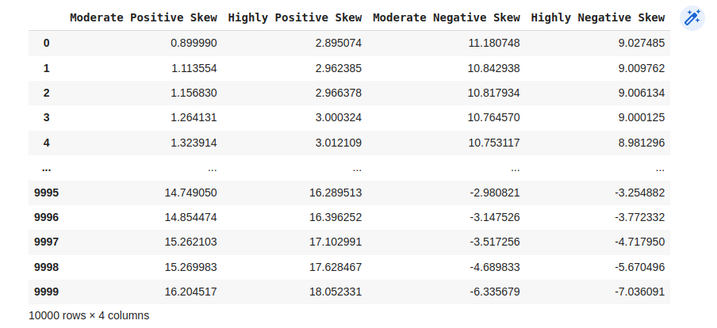
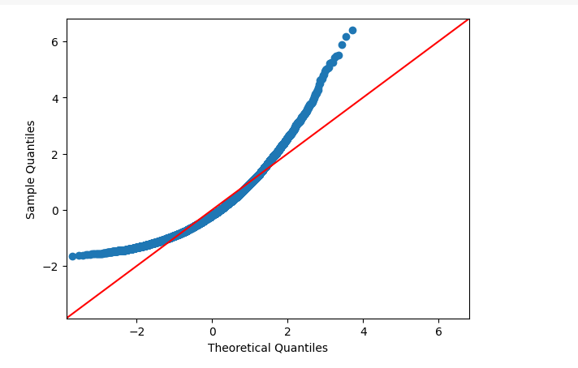
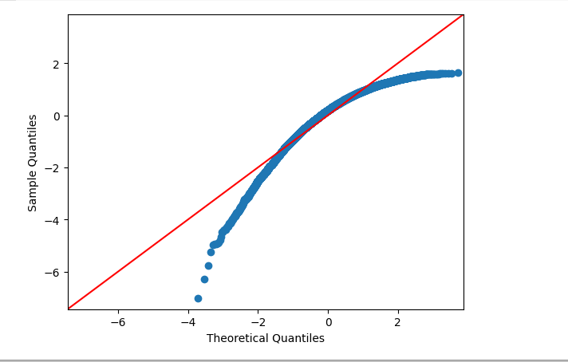
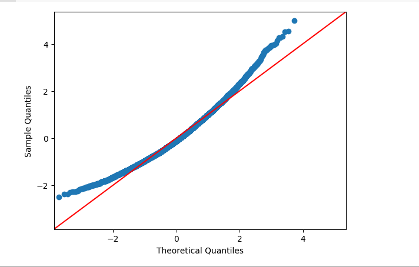
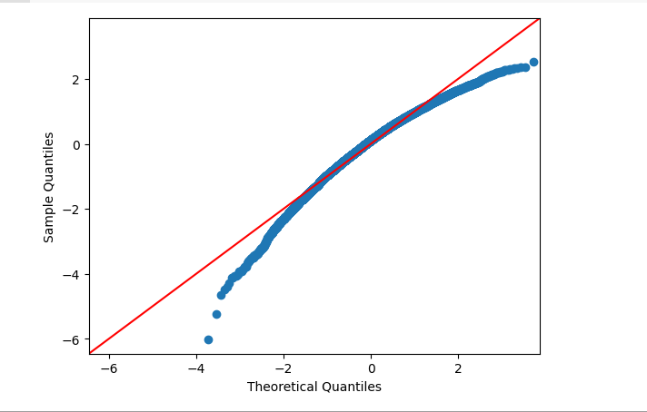
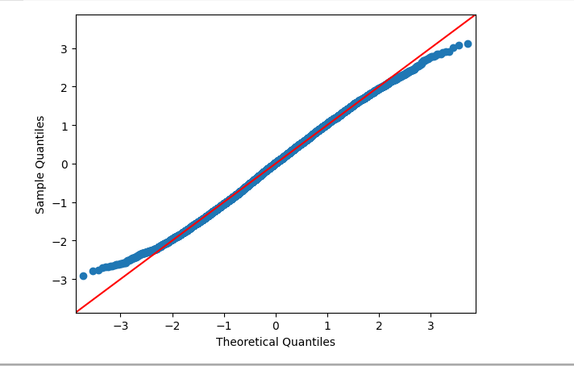
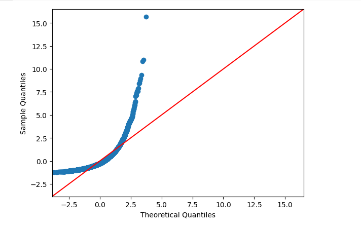
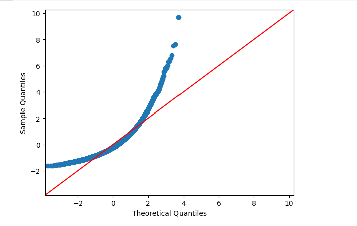
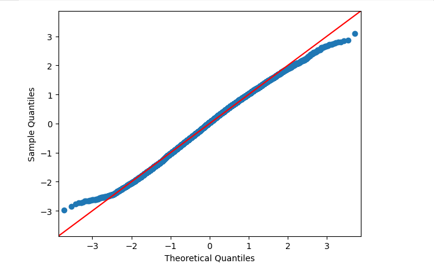
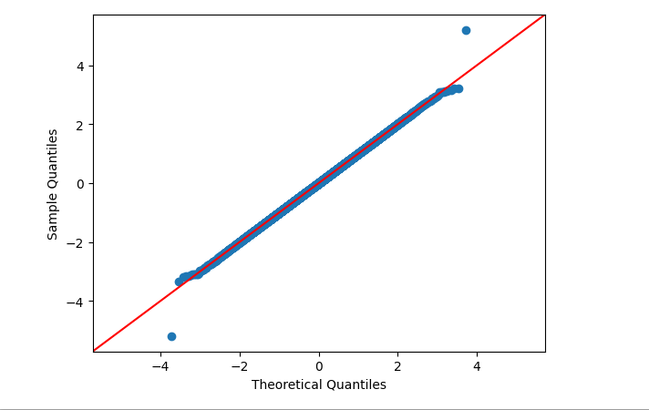

# Ex-06-Feature-Transformation
## AIM :
To read the given data and perform Feature Transformation process and save the data to a file.
## EXPLANATION :
Feature Transformation is a technique by which we can boost our model performance. Feature transformation is a mathematical transformation in which we apply a mathematical formula to a particular column(feature) and transform the values which are useful for our further analysis.
## ALGORITHM :
#### STEP 1 
Read the given Data.
#### STEP 2 
Clean the Data Set using Data Cleaning Process.
#### STEP 3
Apply Feature Transformation techniques to all the features of the data set.
#### STEP 4
Save the data to the file.
## CODE :
```PYTHON
import pandas as pd
df=pd.read_csv("/content/Data_to_Transform.csv")
df
```
```python
import statsmodels.api as sm
import matplotlib.pyplot as plt
sm.qqplot(df['Highly Positive Skew'],fit=True,line='45')
plt.show()
```
```python
sm.qqplot(df['Highly Negative Skew'],fit=True,line='45')
plt.show()
```
```python
sm.qqplot(df['Moderate Positive Skew'],fit=True,line='45')
plt.show()
```
```python
sm.qqplot(df['Moderate Negative Skew'],fit=True,line='45')
plt.show()
```
```python
import numpy as np
df['Highly Positive Skew'] = np.log(df['Highly Positive Skew'])
sm.qqplot(df['Highly Positive Skew'],fit=True,line='45')
plt.show()
```
```python
df['Highly Positive Skew'] = 1/df['Highly Positive Skew']
sm.qqplot(df['Highly Positive Skew'],fit=True,line='45')
plt.show()
```
```python
df['Highly Positive Skew'] = np.sqrt(df['Highly Positive Skew'])
sm.qqplot(df['Highly Positive Skew'],fit=True,line='45')
plt.show()
```
```python
from sklearn.preprocessing import PowerTransformer
transformer = PowerTransformer("yeo-johnson")
df['Moderate Negative Skew 1'] = pd.DataFrame(transformer.fit_transform(df[['Moderate Negative Skew']]))
sm.qqplot(df['Moderate Negative Skew 1'],line='45')
plt.show()
```
```python
from sklearn.preprocessing import QuantileTransformer
qt = QuantileTransformer(output_distribution='normal')
df['Moderate Negative Skew 3'] = pd.DataFrame(qt.fit_transform(df[['Moderate Negative Skew']])) 
sm.qqplot(df['Moderate Negative Skew 3'],line='45')
plt.show()
```
## OUTPUT :










## RESULT :
Thus, the feature transformation for the given csv file is executed successfully.